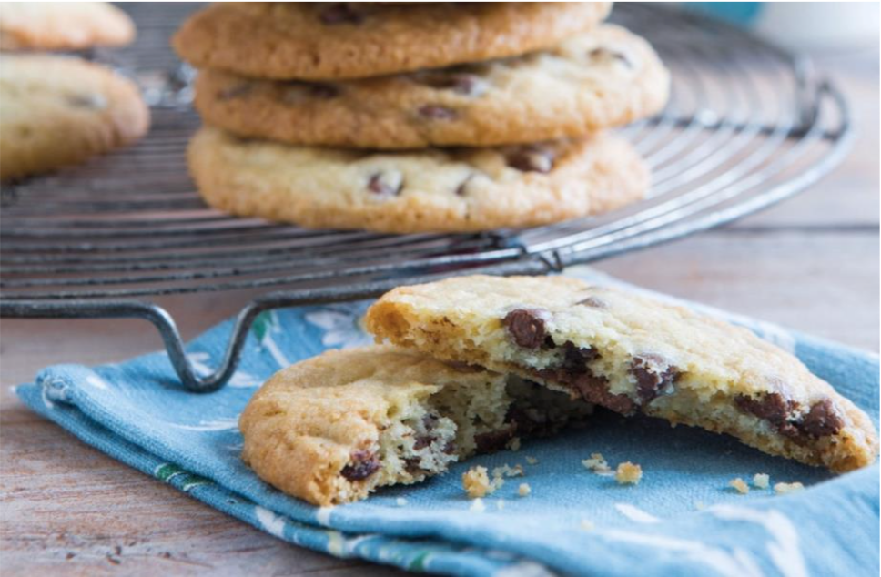

# Watch how to make Easy chocolate chip cookies

## Ingredients

- 225 (1 cup) caster sugar
- 300g (2cups) plain sugar (sifted)
- 200g (1 cup) og butter melted
- 1tsp vanilla extract 
- 1tsp of baking powder 
- A pinch of salt 
- 1 egg
- 100-100g chocolate or chocolate chips

## Methos

- Add the sugar and melted butter in a bowl and mix together –a wooden spoon is fine, no need for a whisk.
- Sift the flour, baking powder, vanilla and salt together and add to the sugar and butter mixture. Add the chocolate chips at this stage if you’re making chocolate chip cookies.
- Mix together using your hand. Once you get a dough texture, add the egg and knead using your hand again.
- Spread some butter onto a baking tray. Take some of the dough, roll into ball then flatten a little. Keep them on the small side as they spread out during baking. Also, don’t keep biscuits close to each other otherwise they will get stuck together.
- Place in the oven and bake at 160C, gas 3 for 10-20 mins. The bigger the cookies, the longer they’ll take to cook. They’re ready when the edges are a bit golden.
